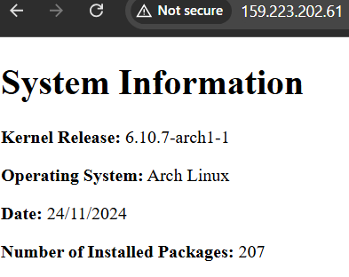

# About Assignment

These instructions are set up using the Arch Linux distribution for Linux. This repository will instruct how to setup a Bash script that generates a static `index.html` file that displays some system information. By using the `systemd` utility, a service file will be configured to execute the script with a timer file that activates the service everyday at 05:00. The HTML document will be served using the web server `nginx` secured by the Uncomplicated Firewall `ufw` package.

# Table of Contents

1. [User Setup](#task-1---user-setup)
2. [Service and Timer Setup](#task-2---service-and-timer-setup)
3. [nginx Configuration](#task-3---nginx-configuration)
4. [Firewall Setup](#task-4---firewall-setup)
5. [Successful Connection Example](#task-5---connect-to-your-web-server)

## Task 1 - User Setup

In this task, the system user is setup with a specified home directory structure. We are creating a **non-login system** user. This type of user is used over a regular or root user because it is being used strictly for system operations and managing our services. The system user is more controlled with limited permissions. Since it is a non-login user, there is also **no direct access available** compared to regular or root users meaning **less risk** in the user account and its files getting compromised.

### Creating the system user `webgen`

To create our system user `webgen`, copy and run the command below:

```
sudo useradd -r -d /var/lib/webgen -s /usr/sbin/nologin webgen
```

`-r` specifies it is a system account/user
`-d` specifies the path of home directory for our user `webgen`
`-s` specifies the shell using the appropriate `nologin` shell since our user is a non-login user

>[!NOTE]
> The `nologin` shell will refuse any login attempts.
### Building the home directory structure

Our new user requires some starter files and subdirectories. So, we are going to manually build the home directory for `webgen` instead of using the `-m` flag to automatically make it during the `useradd` command. After that then we can change the directories and files ownership to `webgen`.

This is the structure we want for our new user with the required files:

```
/var/lib/webgen/
├── bin/ 
│   └── generate_index 
└── HTML/ 
	└── index.html
```

First build the home directory for `webgen` by running the command below:
```
sudo mkdir -p /var/lib/webgen
```

Next, to create the `bin` and `HTML` subdirectories, run the command:
```
sudo mkdir -p /var/lib/webgen/bin /var/lib/webgen/HTML
```

Next we need to create the `generate_index` script file and `index.html` file. Run the commands separately to create them:
```
sudo touch /var/lib/webgen/bin/generate_index

sudo touch /var/lib/webgen/bin/index.html
```

The following will be our bash script that goes in the `generate_index` file. This script will be useful as it declares variables that grabs the system’s information and will output and display the information in an HTML format to our `index.html` file.

Run the command below to open up the file in the text editor:

```
sudo nvim /var/lib/webgen/bin/generate_index
```

Copy paste the code below using your text editor like `neovim` or `vim`.  For the rest of these instructions, I will be referring and using the `neovim` text editor.

```bash
#!/bin/bash

set -euo pipefail

# this is the generate_index script
# you shouldn't have to edit this script

# Variables
KERNEL_RELEASE=$(uname -r)
OS_NAME=$(grep '^PRETTY_NAME' /etc/os-release | cut -d '=' -f2 | tr -d '"')
DATE=$(date +"%d/%m/%Y")
PACKAGE_COUNT=$(pacman -Q | wc -l)
OUTPUT_DIR="/var/lib/webgen/HTML"
OUTPUT_FILE="$OUTPUT_DIR/index.html"

# Ensure the target directory exists
if [[ ! -d "$OUTPUT_DIR" ]]; then
    echo "Error: Failed to create or access directory $OUTPUT_DIR." >&2
    exit 1
fi

# Create the index.html file
cat <<EOF > "$OUTPUT_FILE"
<!DOCTYPE html>
<html lang="en">
<head>
    <meta charset="UTF-8">
    <meta name="viewport" content="width=device-width, initial-scale=1.0">
    <title>System Information</title>
</head>
<body>
    <h1>System Information</h1>
    <p><strong>Kernel Release:</strong> $KERNEL_RELEASE</p>
    <p><strong>Operating System:</strong> $OS_NAME</p>
    <p><strong>Date:</strong> $DATE</p>
    <p><strong>Number of Installed Packages:</strong> $PACKAGE_COUNT</p>
</body>
</html>
EOF

# Check if the file was created successfully
if [ $? -eq 0 ]; then
    echo "Success: File created at $OUTPUT_FILE."
else
    echo "Error: Failed to create the file at $OUTPUT_FILE." >&2
    exit 1
fi
```

There is no need to copy and paste any code or text manually into `index.html` since it will be automatically filled by our `generate_index` script. 

### Setting ownership to `webgen`

Set ownership by copying and running the command below:

```
sudo chown -R webgen:webgen /var/lib/webgen
```

Since we will be using the script to make changes to the output file `index.html` as well as executing the `generate_index` script, it will be in best practice to allow permissions to user `webgen` as well.

```
sudo chmod 770 -R /var/lib/webgen
```

`-R` specifies to make changes recursively of nested directories and files to `webgen`.

## Task 2 - Service and Timer Setup

With our new user and file structure setup, the next task is creating the service file and timer to run the `generate_index` script. Our setup will be made where the service is ran everyday at 05:00 giving us an updated display of the system information.

### Creating `generate_index.service` file

Using the text editor, create the service file in the specified path by running the command below:

```
sudo nvim /etc/systemd/system/generate_index.service
```

Then copy and paste the unit file sections below to the service file:

```ini
[Unit]
Description=Generate Index Script Service
Wants=network-online.target
After=network-online.target

[Service]
User=webgen
Group=webgen
ExecStart=/var/lib/webgen/bin/generate_index
```

In our `[Unit]` section, we use the optional dependency directive `Wants` requiring the network target dependency. Also, we use the `After` directive to tell the script the service to run only after the target is active.

In our `[Service]` section, we specify the user and group `webgen` for the service which tells the service to perform actions based on the limited permissions of `webgen`. Also, the files created by the service will be owned by the specified user and group.

### Creating `generate_index.timer` file

Now that we have our service and script files, we want the service to run that script everyday at 05:00. To do this we need to create a timer unit file similar to the service file.

Run the command below to create and edit a new file under the same path as the service file:

```
sudo nvim /etc/systemd/system/generate_index.timer
```

Then copy paste our configuration for the timer below:

```ini
[Unit]
Description=Generate Index Service Timer

[Timer]
OnCalendar=*-*-* 05:00:00
Persistent=true

[Install]
WantedBy=timers.target
```

The `Persistent` directive will tell the system to run the service if the specified timing was missed. For example, if the server was shut down before the time the service should have ran, the next time the server is up it will run the service immediately.

>[!CAUTION]
> By default, most servers are set to UTC time zone. If you want this timer to run at 05:00 during local time. Refer to the commands below to set a time zone.
> `timedatectl list-timezones ` to view your desired time zone, then:
> `sudo timedatectl set-timezone <time-zone-here>` 
> 
> For example, setting to Vancouver, Canada:
> `sudo timedatectl set-timezone America/Vancouver`

### Enabling the timer

Run the command below to **enable** the timer so it starts automatically after system boot:

```
sudo systemctl enable generate_index.timer
```

Run the command below to **start** the timer:

```
sudo systemctl start generate_index.timer
```

To verify if the **status** of the timer service is active and runs successfully, run the command:

```
sudo systemctl status generate_index.timer
```

You should see part of the output message displayed that says `Active: active(waiting)` which tells that the timer is activate.

To test if the service itself runs successfully, similarly, start the service by running:

```
sudo systemctl start generate_index.service
```

>[!NOTE]
> By starting the service, you are checking the single instance of the service being ran. We **do not** want to enable the service, as the **service's execution will be handled by the timer** which is enabled instead.

And again, check the status:
```
sudo systemctl status generate_index.service
```

You will see in the output that the service's active status is `inactive(dead)` because the service has completed its task in running the `generate_index` script once, and generated the `index.html` file. To see the a detailed log, you can run the command:

```
sudo journalctl -u generate_index.service
```

Below the log you will see that the service started, then generated `index.html` file, and finally deactivated succesfully.

## Task 3 - nginx configuration

In this task, nginx is used and configured to act as a web server to server our `index.html` page and display the system information.

### Install nginx

First, install the nginx package by running the command:

```
sudo pacman -S nginx
```

### Configuring nginx.conf

In the configuration for nginx, I will be making use of server block files. Server block files serve as multiple domains and allows disabling and enabling certain sites. Creating server blocks helps managing separate configurations for different servers or websites easier. Since the server block is split into separte files, they can be easily disabled or enabled without heavily modifying the `nginx.conf` file.

In this configuration step, I will be using the `sites-enabled` and `sites-available` approach.

First create the following directories:

```
sudo mkdir -p /etc/nginx/sites-available /etc/nginx/sites-enabled
```

Using the text editor, create a new server block file by creating and opening the file:

```
sudo nvim /etc/nginx/sites-available/webgen.conf
```

Copy the code below into the `webgen.conf` file created:

```bash
server {
    # Tells which port to listen on. 80 (HTTP).
   listen 80;
    # Specifies IPv6 
   listen [::]:80;

    # The domain name of the incoming traffic, must be unique
   server_name webgen.sysinfo;

    # Specifies the root directory of the website files to serve
   root /var/lib/webgen/HTML;
   # Specifies name of root document or index
   index index.html;
        # Specifies what should be done when user attempts to request `website.com` versus `website.com/help`
        location / {
        # try_files directive used to check for existence of files, in this case it checks the user's request 
        # in the $uri variable in the form of a file and directory.
        # If neither exist, nginx returns a 404 error.
        try_files $uri $uri/ =404;
        }
}
```

Now that the server is configured and the index file is specified, nginx.conf needs to be configured to connect to our desired server.

Using a text editor, open the `nginx.conf` file:

```
sudo nvim /etc/nginx/nginx.conf
```

There will be a lot of default values, and since server blocks are being utilized in this configuration, there are minimal modifications required.

At the top of the `nginx.conf` file, you can see part of the file that specifies the user that is commented out:

```
...
#user http;
worker_processes 1;
...
```

Change this section of code to the code below:
```
user webgen webgen;
worker_processes auto;
```

This allows nginx the correct permissions for file management involving `webgen` and aligns the web server service with our specified user.

>[!NOTE]
> Changing the worker_processes directive is optional, but it defines for nginx the amount of connections accepted and how many processors will be made use. Using `auto` will allow nginx to auto-detect the optimal value.

A last and simple step to modifying the `conf` file is to append our `sites-enabled` directory.

In the `http` block, append the `include` code:

```
...
http {
    include /etc/nginx/sites-enabled/*;
}
...
```

Finally, enable the server block to be utilized by simply creating a symbolic link:

```
sudo ln -s /etc/nginx/sites-available/webgen.conf /etc/nginx/sites-enabled/webgen.conf
```

### Testing nginx services

After the configuration is complete, we can test our nginx services by running a few commands.

First lets restart nginx after all of our changes made:

```
sudo systemctl restart nginx
```

We can test and check for syntax errors in our `nginx.conf` file using the command:
```
sudo nginx -t
```

Then check the status of the nginx service:

```
sudo systemctl status nginx
```

>[!CAUTION]
> You may receive a warning during the status check for your nginx service that looks like:
>
> ` [warn] 18872#18872: could not build optimal types_hash, you should increase either types_hash_max_size: 1024 or types_hash_bucket_size: 64; ignoring types_hash_bucket_size`
>
> Open the `nginx.conf` file and append these configurations in the `http` block to fix this error:
> ```
> http {
>    types_hash_max_size 4096;
>    server_names_hash_bucket_size 128;
>    ...
> }
> ```
> Restart and check the status of the nginx service after making these changes.

## Task 4 - Firewall Setup

Now that the server is configured, a firewall can be setup to secure the server. We will be using Arch Linux's Uncomplicated Firewall (UFW) which is a program that manages nftables and iptables, essentially filtering traffic before it reaches the network. In this instruction, we will set up UFW to allow `ssh` and `http` from anywhere as an instructional example. In practice, `ssh` should be only allowed in enterprise settings.

### Installing `ufw` package

First, use the `pacman` package manager to install `ufw`:
```
sudo pacman -S ufw
```

>[!WARNING]
> **Do not** enable UFW immediately after installing the package. We will need to configure it to allow ssh and http otherwise we will not have access to the remote system anymore after exiting.

### Allowing `ssh` and `http` access

For instructional reasons, we will enable ssh from anywhere. In practice, we would **only** allow ssh connections from specific and private ip addresses, as well as using host service that authorizes private connections.

To allow **ssh connection**:
```
sudo ufw allow ssh
```

We also want to **limit the rate of ssh** attempts to prevent multiple unauthorized attempted connections:
```
sudo ufw limit ssh
```

Next, since we are working with web servers, we want to allow **http connections**:
```
sudo ufw allow http
```

After each of these commands, we will see an output message saying `Rules updated` and `Rules updated (v6)`.

Finally, enable `ufw` after creating our rules:
```
sudo ufw enable
```

To **check the status** of the firewall and our rules:
```
sudo ufw status verbose
```

Your output should be displayed like below:
```
Status: active

To                         Action      From
--                         ------      ----
22                         LIMIT IN    Anywhere                  
80                         ALLOW IN    Anywhere                  
22 (v6)                    LIMIT IN    Anywhere (v6)             
80 (v6)                    ALLOW IN    Anywhere (v6)  
```

At this point your firewall should be active and enabled on system startup. If you run into errors please refer to the troubleshooting section below.

### Troubleshooting
You may run into errors regarding iptables while allowing connections. For example:

``` 
[Errno 2] iptables v1.8.10 (legacy): can't initialize iptables table 'filter': Table does not exist (do you need to insmod?)
Perhaps iptables or your kernel needs to be upgraded.
```

To fix this error, you may need to update your system and packages (as it states the iptable version is a legacy version). Run these commands below to fix this error:

Updating system:
```
sudo pacman -Syu #
```
Installing new iptables version:
```
sudo pacman -S iptables
```
Restart iptables service:
```
sudo systemctl restart iptables
```

>[!NOTE]
> If the error still exists, your system may need to be rebooted using `sudo reboot` which will kick you out of your remote Linux system and will require you to ssh back in. Keep in mind that we still have **not** enabled the UFW yet, so we are still able to regularly ssh in.

## Task 5 - Connect to your web server

With our web server all set up and secured by a firewall, we can attempt to connect to look at the HTML document.

